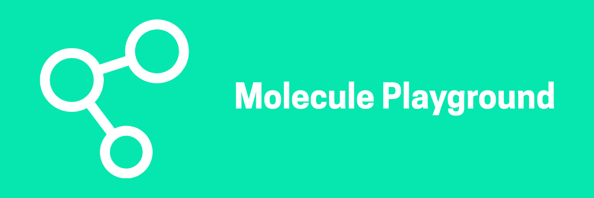

<div align="center">
  <a href="https://github.com/othneildrew/Best-README-Template">
    
  </a>
</div>

## About

This project is a compilation of components following the atomic design pattern. Combining atomic level components like buttons and labels to from molecule level components like dropdowns, modals, datepickers and so on.


## Tech used

This project are built with

   


## Getting started

First, install all the dependencies: 

```bash
npm install
# or
yarn
```

Run the development server:

```bash
npm run dev
# or
yarn dev
```


## Contributors


## Acknowledgement


